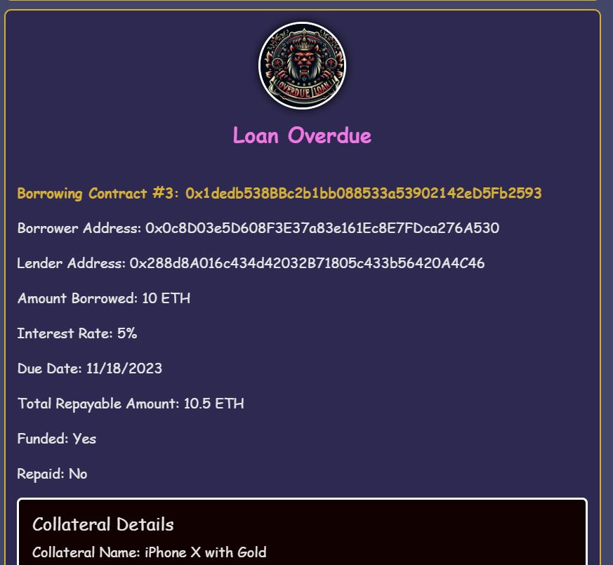

# Capstone Project: Peer-to-peer Lending DApps

    

## Introduction

Thailand's increasing demand for loans, typically for asset acquisition and business funding, faces challenges with traditional sources like banks and pawnshops due to procedural delays, stringent credit checks, and high-risk alternative lending options.

### Problem Domain
- **Dependence on Traditional Institutions**: Involves extensive paperwork and slow processing.
- **Strict Credit Checks**: Excludes many potential borrowers.
- **Risky Alternative Lending**: Non-institutional sources often have high interest rates and lack security.

    

### Proposed Solution: P2P Lending and Borrowing System

P2P system integrates Blockchain technology and Smart Contracts to revolutionize lending and borrowing:
- **Decentralized Approach**: Reduces reliance on traditional financial institutions.
- **Automated Security with Smart Contracts**: Ensures adherence to lending terms, lowering default risks.
- **Broadened Lending Access**: Inclusive for those previously marginalized by conventional credit systems.
- **Transparency and Fairness**: Enabled by Blockchain, ensuring equitable transactions.

    

---

## Smart Contracts

    

### BorrowingContract.sol
The Borrower Contract is a sophisticated smart contract designed for seamless and secure transactions within the blockchain ecosystem. Aimed primarily at facilitating borrowing and lending processes, this contract introduces a range of functionalities to ensure transparency and efficiency
| Function         | Purpose |
|------------------|---------|
| `setLender`      | Establishes the identity of the lender, setting a clear agreement for the loan. |
| `repayLoan`      | Enables borrowers to repay their loans, central to maintaining the integrity of the lending process. |
| `claimCollateral`| Allows the lender to claim the collateral in case of a loan default, providing security for the loan. |
| `setInterestRate`| Adjusts the loan's interest rate, a critical factor in loan management and financial planning. |
| `setLoanTerm`    | Defines the duration of the loan, ensuring clear terms for repayment. |

### PoolLendingContract.sol
The Pool Lending Contract is a streamlined smart contract developed for the blockchain platform, specifically designed to facilitate pooled lending activities. 
| Function    | Purpose |
|-------------|---------|
| `lendFunds` | This pivotal function allows participants to lend their funds into a collective pool. It is instrumental in aggregating resources from multiple lenders to provide substantial loan amounts. |
| `getSummary`| This feature provides a comprehensive overview of the contract's status, including total funds lent, active loan details, and overall pool performance. |

### LoanManagementContract.sol
This contract can be viewed as a Factory contract - a single contract to be deployed, managing all the interaction with blockchain

| Function Category                        | Functions                                 |
|------------------------------------------|-------------------------------------------|
| Creating Lending and Borrowing Contracts | `createLendingContract`                   |
|                                          | `createBorrowingContract`                 |
| Loan Repayment and Collateral Management | `borrowerRepayLoan`                       |
|                                          | `lenderClaimCollateralFromLoan`           |
| Utility Functions                        | `getLendingContractsByLender`             |
|                                          | `getBorrowingContractByBorrower`          |
|                                          | `lendingContractSummary`                  |
|                                          | `borrowingContractSummary`                |
|                                          | `getProductDetailsFromBorrowingContract`  |
|                                          | `getAllProductsOwnedBy`                   |

---

## Overview of the Application Interaction

    

---

## Working with the Application

### Project Setup
1. Installed the required modules including Truffle, Node.js (node), npm, and Ganache for hosting and deploying the blockchain on local network.
2. Download our project source code. 
3. Open a new workspace on Ganache, rename the workspace to something like “P2P Lending” and click “ADD PROJECT”. This will prompt a window popup. Then navigate to our source code, locate the “truffle-config.js” then click “START” or “SAVE WORKSPACE” (for the older version of Ganache) at the top right hand corner. 
4. Open the source code in some IDE like Vscode and open a new terminal to run the following command and note that the Ganache needs to be running in the background: `truffle compile` then `truffle migrate - - reset`
5. To test the contracts, please type ‘truffle test’ into a separate command line or terminal
6. To start the application we have to run the command “npm run start”. In the following image, we will show that there might be the following error due to a version of node mismatch. In order to solve this issue run the following command depending on your operating system. For Window: `set NODE_OPTIONS=--openssl-legacy-provider`. For macOS: `chmod +x node_modules/.bin/react-scripts`
7. The program should run successfully and you will be greeted with the following page. Please run the program on a browser with MetaMask Google Chrome extension installed. A password for MetaMask should be provided as well. Afterward, the application homepage will be displayed.

### Application Snapshots and Interaction Explaination

    

Homepage of the application. On the left column, user can create lending contract; whereas, the form in the right column can be used to create borrowing contract. All the contracts will be displayed in their respective columns

    

In this example, the Lender insert the value 50 ETH into the form to create lending contract

    

The MetaMask poped for the user to confirm the transaction. Pay attention to the value to be transfer. It is equivalent to the funds of 50 ETH plus small amount of gas fees

    

New Lending contract has been successfully created

    

Swithch the wallet from the lender to borrower. Borrower can select which lending contract to lend the money from. Insert the required information into the form and click submit button. A MetaMask notification, similar to the lending contract confirmation, should be displayed

    

New borrowing contract has been created. In order to repay the loan, the borrower put in the value corresponding to the field "Total Repayable Amount". Then click the repay loan button

    

This is sample MetaMask confirmation for the repay loan transaction

    

The status of the loan will changed after the repayment of loan is successfull

    

This is the current ETH in the Lender valet. Before the repayment, the amount would be close to 50 ETH as the lender made a lending contract worth 50 ETH. After the repayment of 11.2 ETH, the accumulated ETH should be around 61 ETH. This align with the picture shown above

    

When the repayment period is over, the borrowing contract will change to overdue. The borrower can no longer repay the loan

    

Switch from the borrower account to lender account to see the changes in the interface. A button is visual only to the lender of the contract when the contract repayment period has passed. This button allows the lender to claim the ownership of the collateral

    

This is a picture to show the status of the loan when it hasn't been repaid yet

    

In the summary page of the application, borrower and lender can see the information regarding both borrowing and lending contract assocated to them. From the borrower perspective, there are two loan that needed to be repaid

    

This shows the accumulated amount that the borrower own to different lender 

    

This is from the perspective of the lender. There are two pending repayment. The accumulated amount is displayed at the top

    

Lastly, this is the information regarding the value of the collateral that the lender claimed from overdue loan

---

## Future Project Improvement
Collateral Management: minted the real-world asset into NFT, which can be converted into our platform ERC20 token that is used for collateral. We would add the fractionalization functionality to the collateral which allows the borrower to split the collateral into smaller units that can be used for borrowing. This can prove to be more practical and user-friendly as some users might want to make multiple loans, but they don’t have enough resources to use. Nonetheless, this poses a challenging question regarding how to manage the real-world asset such as how can we ensure that the asset is safe guarded in order to not compromise the lender in the case of overdue loan payment. There is a particular blockchain solution that implements real-world assets as collateral called Collateral Network (https://collateralnetwork.io/). Unfortunately, we couldn’t find how exactly they manage the collateral. 

Using Openzeppelin for ERC20 and SafeMath: current development setup caused the Openzeppelin to crash due to a mismatched environment. When we initially developed the smart contract on Remix IDE, we had no issue with the versioning. We made our own Token to use as collateral as well and manage the transaction correctly. However, this is a prominent problem in local development that hindered our utilization of the great open source tools for developing secured smart contracts and dApps. 

Improve Functionality: the search for individual contracts on the homepage and blur out the borrowing contract that doesn’t belong to the current account. Mainly the reason why the current version of the application shows so much information is because we really want to show that our application made the correct transaction. This is our approach to creating minimum viable products, or MVP, to show enough significant functions that peer-to-peer lending should have and that they existed in our application. 

## Thank you!
